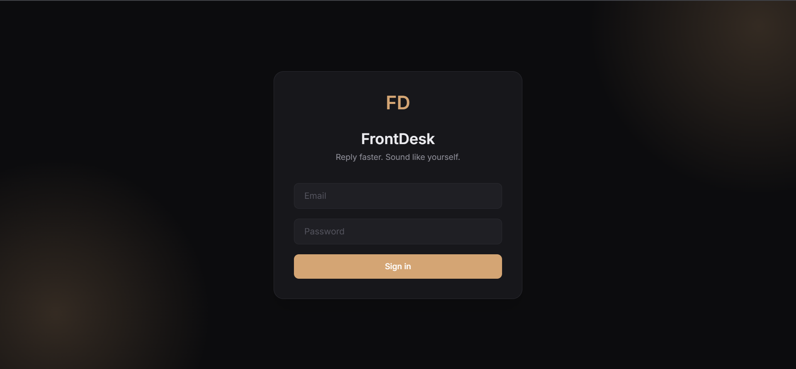
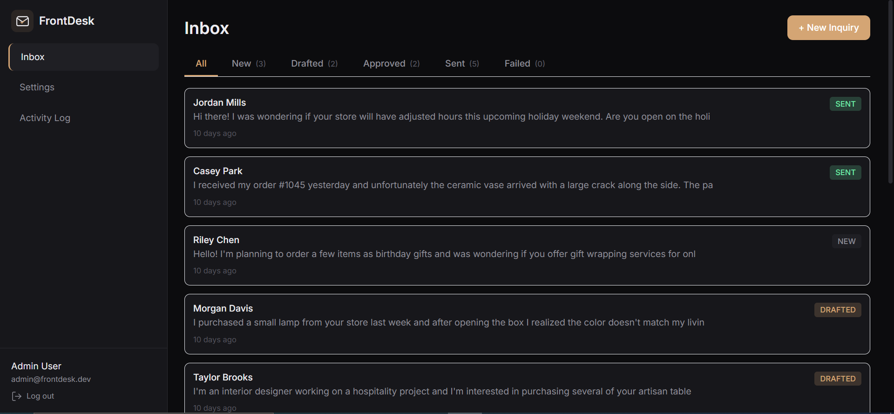
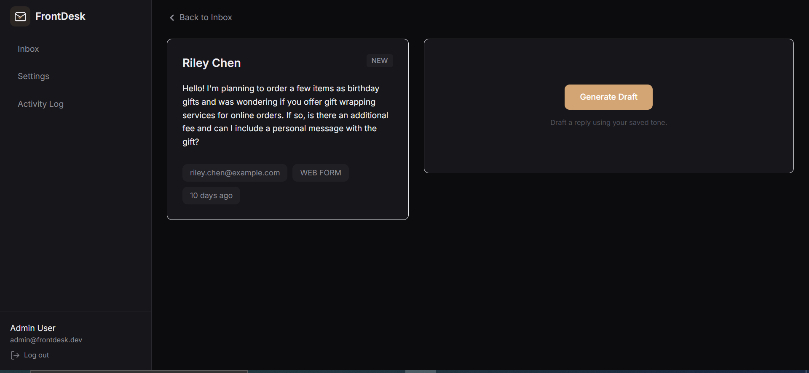
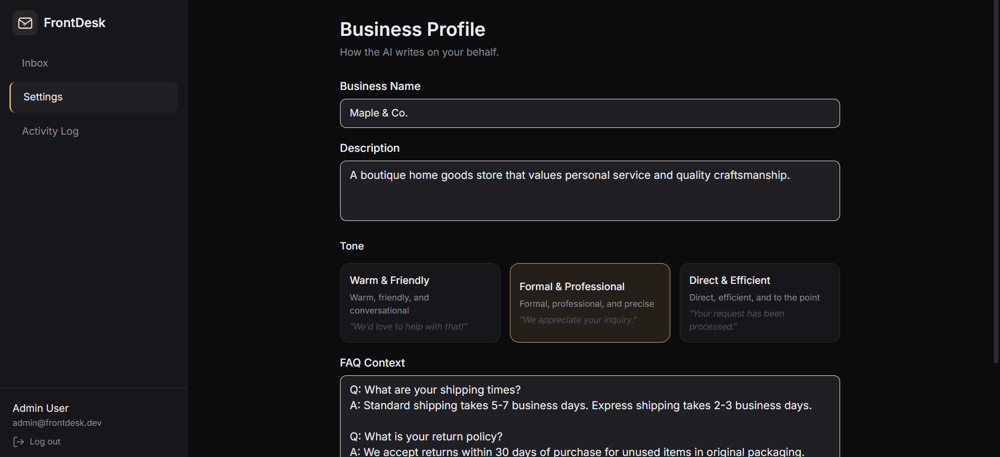
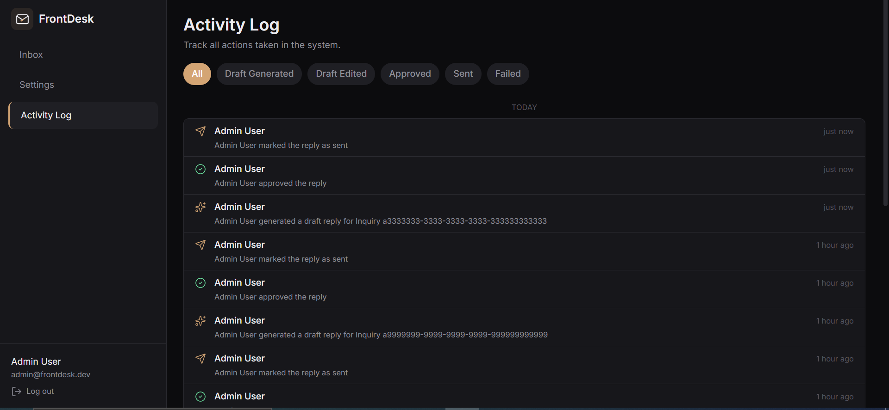

# FrontDesk

A tool that reads customer messages, drafts a reply using AI, and waits for a human to click approve before anything goes out. Built because letting an AI email your customers unsupervised is a decision you make once.

---

## Live Demo


**Website:** [https://frontdesk-reply-assistant.vercel.app](https://frontdesk-reply-assistant.vercel.app)  
**Login:** `admin@frontdesk.dev` / `FrontDesk2024!`

> **Note:** The backend is hosted on Render's free tier, which puts the server to sleep after 15 minutes of inactivity. If you're the first visitor in a while, the initial request or login might take 20–30 seconds while the server wakes up. Everything after that is fast.
---

## Screenshots

### Login


### Inbox


### Reply Workspace


### Settings


### Activity Log


---

## The Problem

Small businesses answer the same questions on repeat. What are your hours. Do you ship to my area. Can I return this. Every reply is written from scratch, and the person writing them has better things to do.

## What This Does

Customer message comes in. Staff clicks Generate Draft. AI writes a reply using the business's saved tone and FAQ context. Staff reads it, edits if needed, approves, and sends. Every action is logged automatically.

The AI does not send anything on its own. That is the whole point.

---

## Features

- Inbox with status filters (New, Drafted, Approved, Sent, Failed)
- One-click AI draft generation grounded in a configurable business profile
- Editable draft before approval, because AI is confident but not always correct
- Automatic activity log of every draft, edit, approval, and send
- Three configurable tones: Warm, Formal, Direct
- Manual inquiry creation (stands in for a real email inbox connector)

---

## Stack

| Layer | Choice |
|---|---|
| Backend | Java 17, Spring Boot 3, Maven |
| Database | PostgreSQL 16, Flyway migrations |
| Auth | JWT stored in memory, not localStorage |
| Frontend | React 18, TypeScript, Vite, TailwindCSS |
| State | React Query for server data, Zustand for auth session |
| AI | Groq (llama-3.3-70b-versatile) |
| Hosting | Render (backend + Postgres), Vercel (frontend) |

---

## Running Locally

### What You Need

- Java 17
- Maven 3.9 or newer
- Node 18 or newer
- PostgreSQL 16 installed directly (Docker is optional and skipped here)
- A free Groq API key from https://console.groq.com

### 1. Set Up Postgres

Install PostgreSQL 16. Remember the password you set during install. Open pgAdmin, right-click Databases, create a new database called `frontdesk`.

### 2. Backend

```bash
cd backend
cp src/main/resources/application.yml.example src/main/resources/application.yml